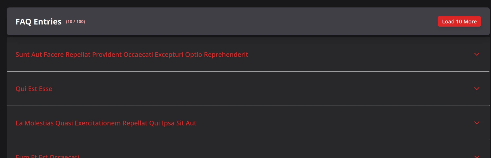

# Example FAQ Component

### Expandable Accordion Component with Control Header.

Display _n_ items in an accoordion component, if available, more will be displayed on button click.



## Scripts

- **Development**: Start the development server with hot reloading.

  ```
  npm run dev
  ```

- **Build**: Compile TypeScript and build the project for production
  ```
  npm run build
  ```
- **Test**: Run tests using Vitest.
  ```
  npm run test
  ```

---

Built with React, TypeScript, Vite, Tailwind, and shadcdn by a human with a computer.
